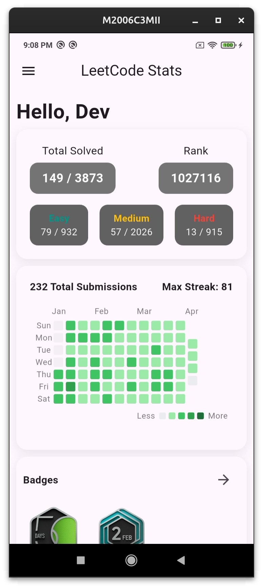
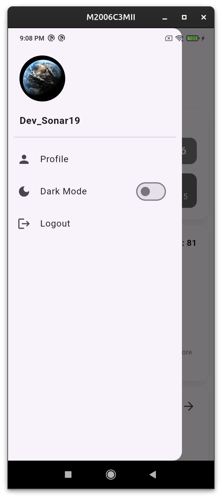
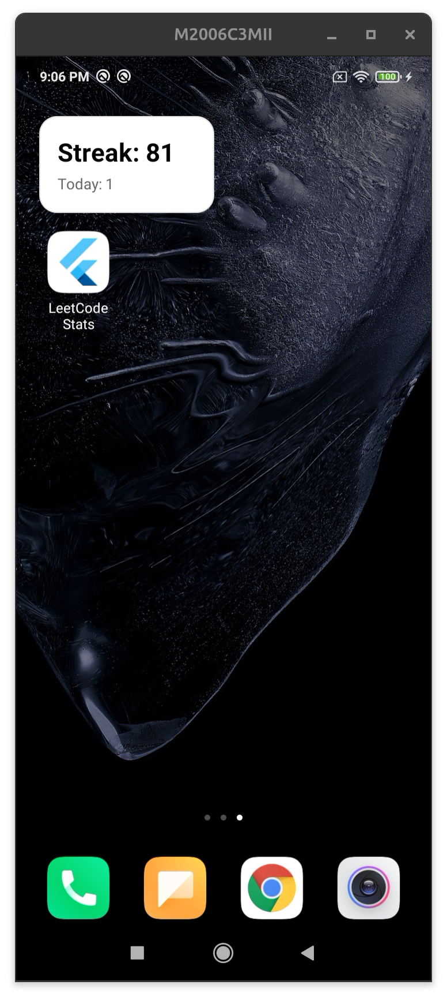

# LeetCode Stats App (Beta)📊

A lightweight Flutter app to track your **LeetCode progress** with a clean mobile dashboard.

| | | |
|---|---|---|
|  |  |  |

## 🚀 Features

* Profile dashboard 
* Easy / Medium / Hard problems solved
* 5 recently solved questions
* LeetCode badges
* GitHub-style submission heatmap
* Daily question
* Dark mode

## ⚠️ Beta Notes

* Login session may not persist yet
* First login can take **up to ~1 minute** because the backend server (Render free tier) may need to wake up

## 🔜 Coming Soon

* Home screen widget
* More detailed profile stats
* UI & performance improvements

APK available in **Releases**.
* https://github.com/Devsonar19/LeetCode-Stats/releases/tag/v0.0.1(Beta) 

> [!IMPORTANT]
> **Status: Early Development** > This project is currently in the very early stages of development. Features are being planned, and the core architecture is being built.

---

A cross-platform application designed to provide a **beautiful, intuitive dashboard** for tracking and visualizing your LeetCode progress. Whether you're preparing for technical interviews or competitive programming, this app helps you stay on top of your game across all your devices.

---

## 🚀 Vision
The goal of this project is to move beyond simple statistics and provide a comprehensive visual representation of your coding journey.

### Key Features (In Progress)
* **Beautiful Dashboard:** A modern, clean UI focusing on data visualization, including progress charts, category breakdowns, and consistency streaks.

* **True Cross-Platform:** Built to run seamlessly on:
    * 📱 **Android**
    * 🍏 **iOS**
    * 🌐 **Web**

---

## 🛠️ Tech Stack (Planned)
* **Frontend:** Flutter (Multi-platform UI)
* **State Management:** Provider / BLoC
* **Backend:** FastAPI, GraphQL
