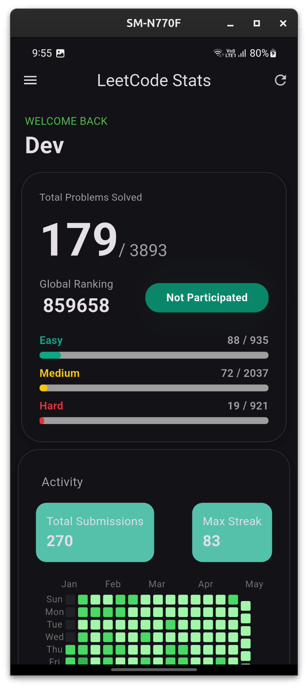
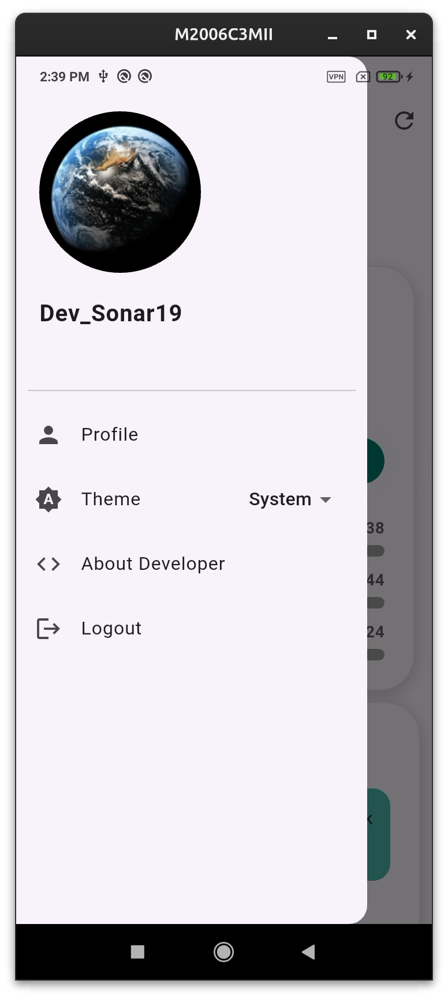
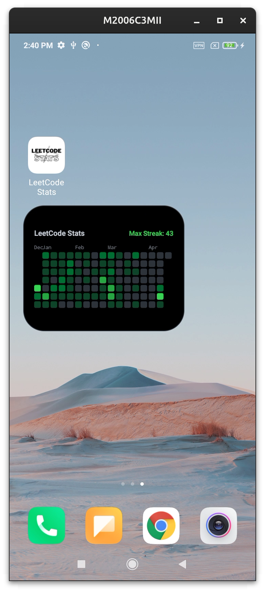
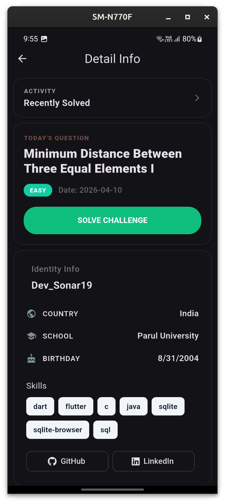
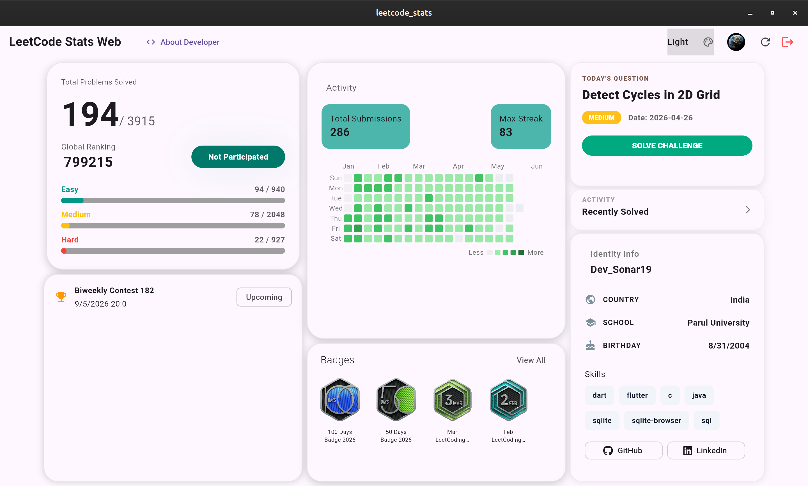
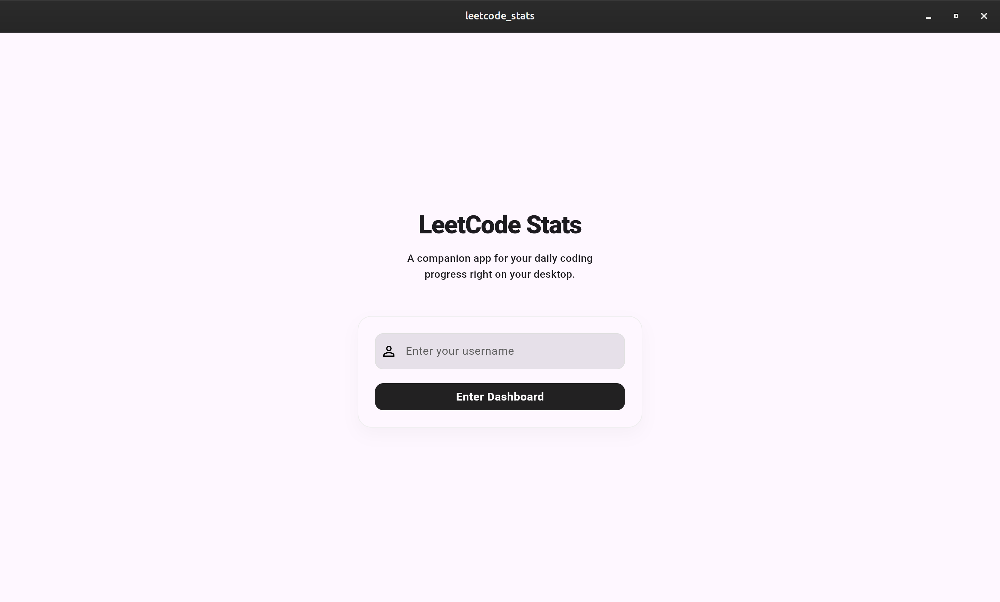

# LeetCode Stats 📊

## 🚀 Overview

I built this app because existing solutions felt limited.

LeetCode provides data—but not a great experience around it. Heatmaps are locked inside the platform, customization is minimal, and there’s no way to bring your progress into your daily workflow.

### Android
| Dashboard | Drawer | Widget | Profile |
|:---:|:---:|:---:|:---:|
|  |  |  |  |

### Linux
| Dashboard | Login |
|:---:|:---:|
|  |  |

## ✨ Features

### 🧭 Core Experience
- Redesigned **Dashboard** for better clarity and flow  
- Smooth and responsive UI built with Flutter  
- Dark mode support (System as well as Custom)

### 📊 Progress Tracking
- GitHub-style **submission heatmap**  
- **Daily question**  
- Easy / Medium / Hard problem breakdown  
- **LeetCode badges support**

### 🏆 Contest System
- Dedicated **Contest Card**
- Full **Contest Page**
- **User rating**

### 📱 Home Screen Widget (Major Feature)
- Heatmap directly on your home screen  
- Displays **maximum streak**  
- Built for quick, glanceable insights  

### 🔐 User Experience
- Improved login flow  
- Better error handling & fallback states  
- Stable and reliable data fetching  

### 👨‍💻 Extras
- **About Developer screen**
- External profile links (GitHub, LinkedIn, etc.)

APK available in **Releases**.
* https://github.com/Devsonar19/LeetCode-Stats/releases

A cross-platform application designed to provide a **intuitive dashboard** for tracking and visualizing your LeetCode progress. Whether you're preparing for technical interviews or competitive programming, this app helps you stay on top of your game across all your devices.

---

## 🚀 Vision
The goal of this project is to move beyond simple statistics and provide a comprehensive visual representation of your coding journey.

## 🛠️ Tech Stack
* **Frontend:** Flutter (Multi-platform UI)
* **State Management:** BLoC
* **Backend:** FastAPI, GraphQL
